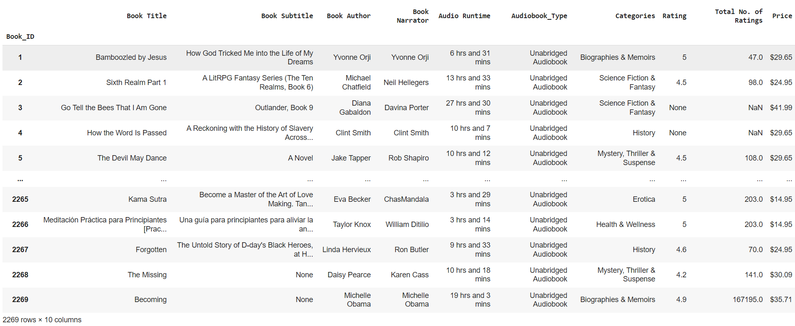
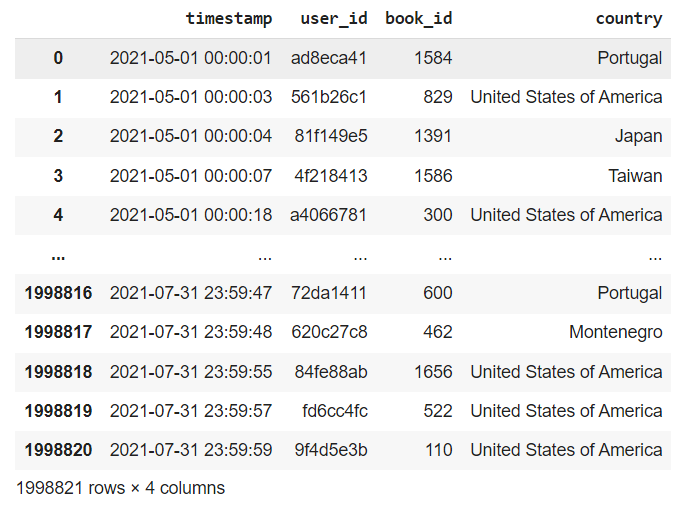
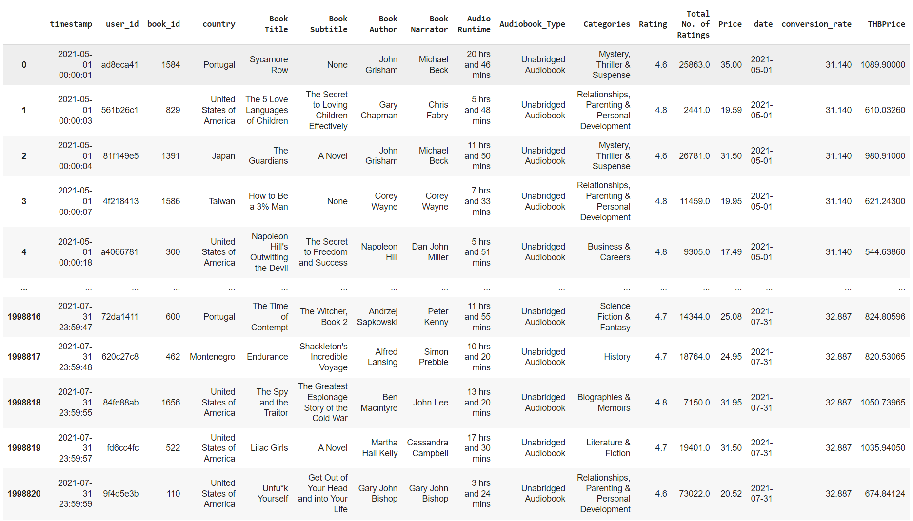
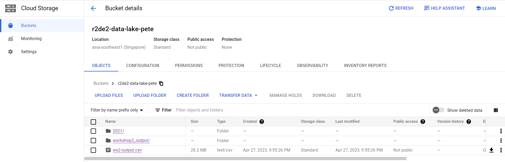
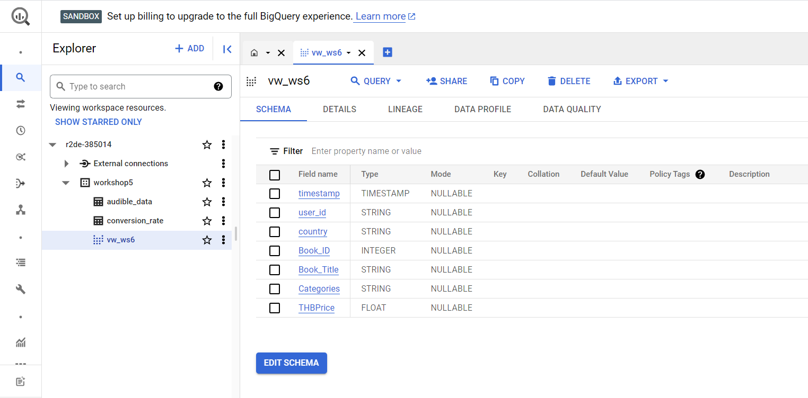
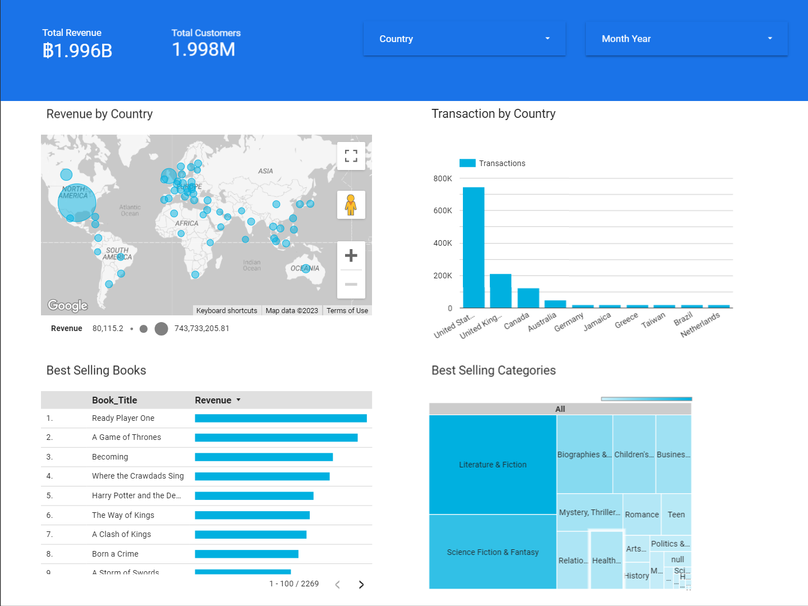
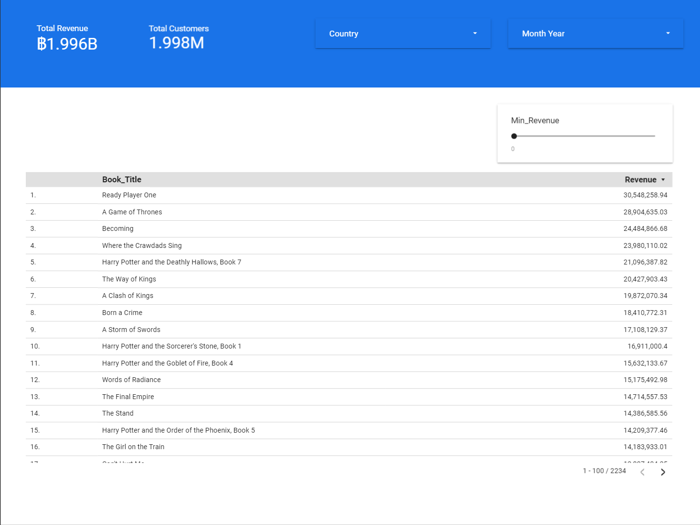
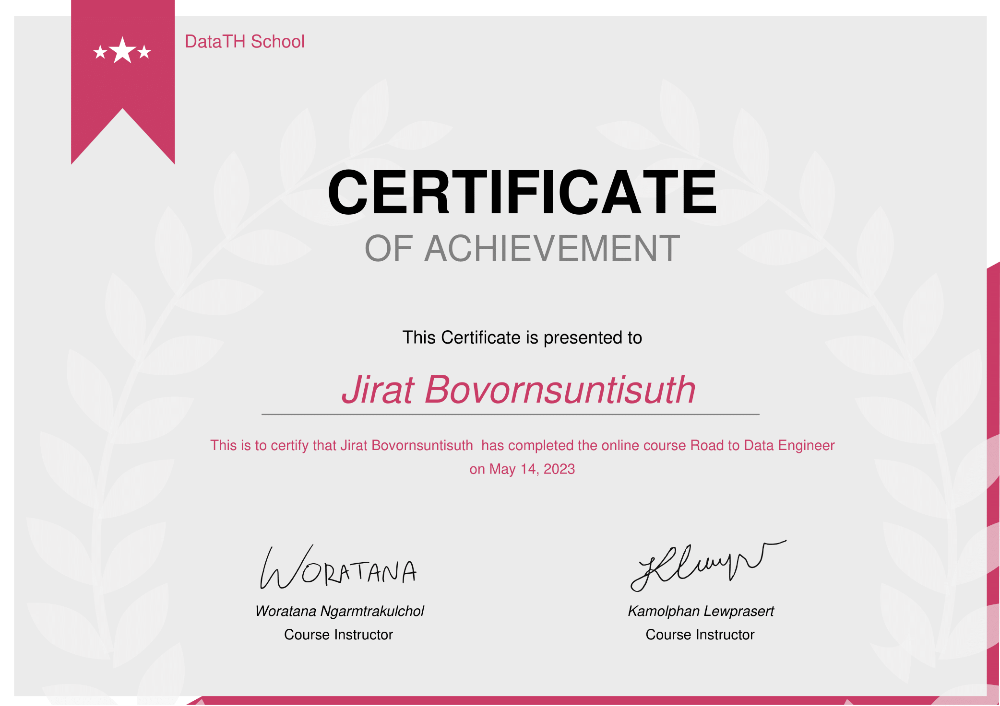

<h1 align="center">Road to Data Engineer Project</h1>
<h2>Project Overview</h2>

This project showcases the knowledge and skills gained from the comprehensive "Road to Data Engineer (R2DE 2.0)" course. The project aims to demonstrate proficiency in data engineering concepts, tools, and technologies by constructing a comprehensive end-to-end data pipeline that covers various stages of data processing, integration, transformation, storage, and visualization.

<h2>Course Concepts Applied</h2>

Throughout the course, I acquired a solid foundation in SQL and Python, essential for data manipulation and analysis. I explored fundamental data engineering principles, including data extraction, data cleansing with Apache Spark, and data integration from various sources such as REST APIs using Pandas.

I delved into cloud computing using Google Cloud Platform (GCP), learning how to create a basic Data Lake and process data efficiently. I automated data pipelines using Apache Airflow, orchestrating complex workflows and ensuring data consistency.

The project also explores advanced topics like data warehousing with Google BigQuery and data visualization using Google Data Studio.

<h2>Technologies and Tools Used</h2>
<ul>
  <li>Python</li>
  <li>SQL</li>
  <li>Pandas</li>
  <li>Apache Spark</li>
  <li>Apache Airflow</li>
  <li>Google BigQuery</li>
  <li>Looker Studio</li>
</ul>

<h2>Workflow Overview</h2>

<em>Workflow diagram</em>

 

<h2> Workshop 1: Data Collection & Integration with Pandas</h2>

Aggregated data from various sources, including MySQL databases and REST APIs, utilizing techniques such as requests and Pandas.

<em>Example of audible data dataset</em>

 

<em>Example of audible transaction dataset</em>

 

<h2> Workshop 2: Data Cleansing with Apache Spark</h2>

Performed initial Exploratory Data Analysis (EDA) and data manipulation using Spark on Google Colab. This included exploratory data mining to unveil insights and patterns.

<em>Final dataset</em>

 

<h2> Workshop 3: Intro to Google Cloud & Google Cloud Storage</h2>

Experimented with Cloud Storage for file uploads and explored fundamental command-line operations using Cloud Shell.

<em>Google Cloud Storage</em>

 

<h2> Workshop 4: Automate Data Pipeline with Airflow</h2>

Created an automated data pipeline using Apache Airflow, integrating code from Workshop 1 and Workshop 3. This enabled me to orchestrate data collection and processing tasks, transforming them into an automated workflow. The result was an efficient and streamlined data pipeline that harnessed the power of automation for enhanced data management and processing.

 

<h2> Workshop 5: Building a Big Data Warehouse with BigQuery</h2>

Learned to use Google BigQuery and integrated it with Apache Airflow, a progression from Workshop 4. This integration enabled me to automate the transfer of data from Google Cloud Storage into Google BigQuery, streamlining the data pipeline process. Subsequently, I generated view from audible_data table within Google BigQuery to show only necessary columns for the visualization

<em>Google BigQuery</em>

 

<h2>Workshop 6: Data Visualization with Looker Studio</h2>

Developed data visualization dashboard using Looker Studio, using data derived from BigQuery. The dashboard assists the product and marketing teams in their decision-making processes.

 

<em>Dashboard 1</em>

Presented summarized information from Dashboard 1 includes:

<ul>
  <li>Total revenue by country</li>
  <li>Total customers by country</li>
  <li>Number of transactions in each country</li>
  <li>Bestselling books</li>
  <li>Bestselling book categories</li>
</ul>
 

<em>Dashboard 2</em>

Presented summarized information from Dashboard 2 includes:

<ul>
  <li>Book title and revenue based on criteria (<em>min_revenue</em>)</li>
</ul>
 

<h2>Conclusion</h2>

By completing this project, I have not only demonstrated practical proficiency in data engineering but also showcased the ability to apply cutting-edge technologies to solve real-world data challenges. The project stands as a testament to the comprehensive learning journey undertaken during the "Road to Data Engineer" course.

This project reflects my dedication to mastering data engineering skills, contributing to the broader data engineering community, and fostering a deeper understanding of the intricacies involved in building robust and efficient data pipelines.

<h2>Certificate</h2>

With the successful completion of the 'Road to Data Engineer' course, I proudly showcase my certificate of achievement.

 

<em>Road to Data Engineer Certificate</em>

