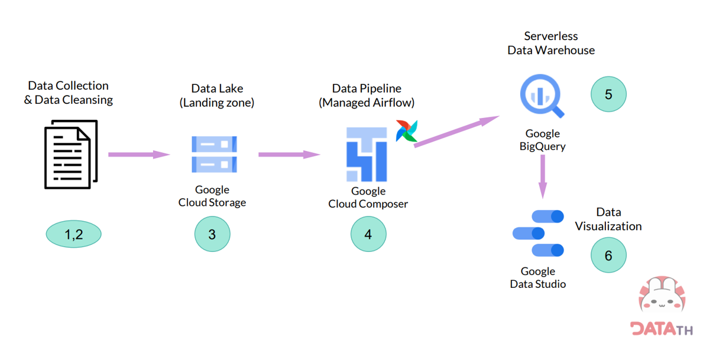

<h1 align="center">Road to Data Engineer Project</h1>
<h2>Project Overview</h2>

This project showcases the knowledge and skills gained from the comprehensive "Road to Data Engineer (R2DE 2.0)" course. The project aims to demonstrate proficiency in data engineering concepts, tools, and technologies by building an end-to-end data pipeline that covers various stages of data processing, integration, transformation, storage, and visualization.

<h2>Course Concepts Applied</h2>

Throughout the course, I acquired a solid foundation in SQL and Python, essential for data manipulation and analysis. I dived into fundamental data engineering concepts, including data extraction, data cleaning with Apache Spark, and data integration from diverse sources like REST APIs using Pandas.

I delved into cloud computing using Google Cloud Platform (GCP), learning how to create a basic Data Lake and process data efficiently. I automated data pipelines using Apache Airflow, orchestrating complex workflows and ensuring data consistency.

The project also explores advanced topics like data warehousing with Google BigQuery and data visualization using Google Data Studio.

<h2>Technologies and Tools Used</h2>
<ul>
  <li>Python</li>
  <li>SQL</li>
  <li>Pandas</li>
  <li>Apache Spark</li>
  <li>Apache Airflow</li>
  <li>Google BigQuery</li>
  <li>Looker Studio</li>
</ul>

<h2>Workflow Overview</h2>

